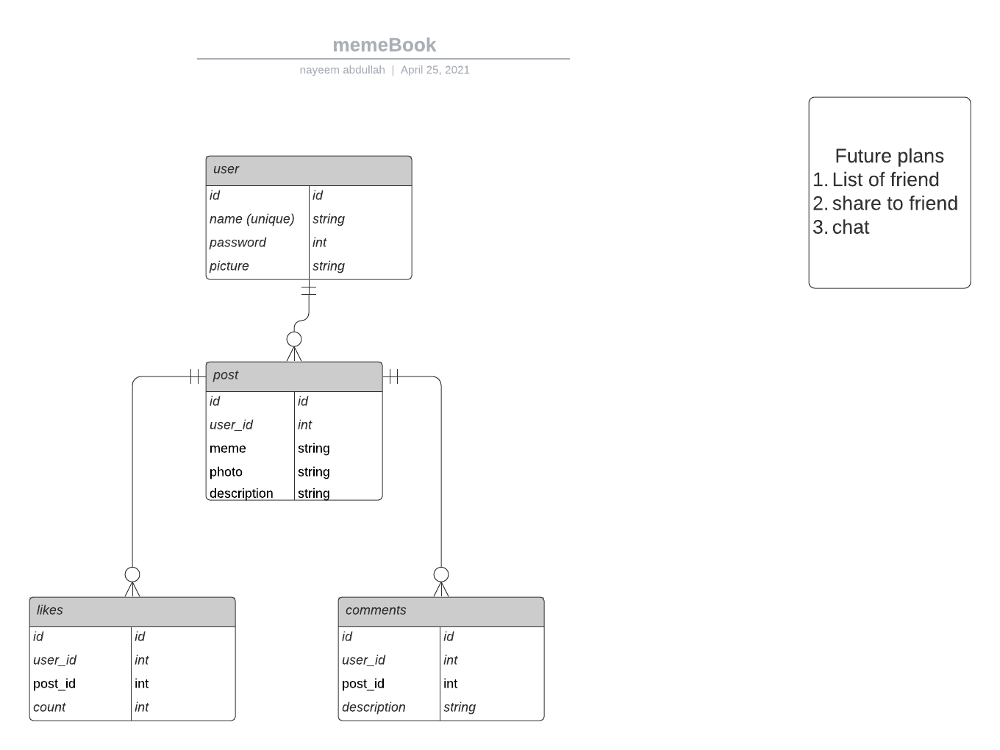
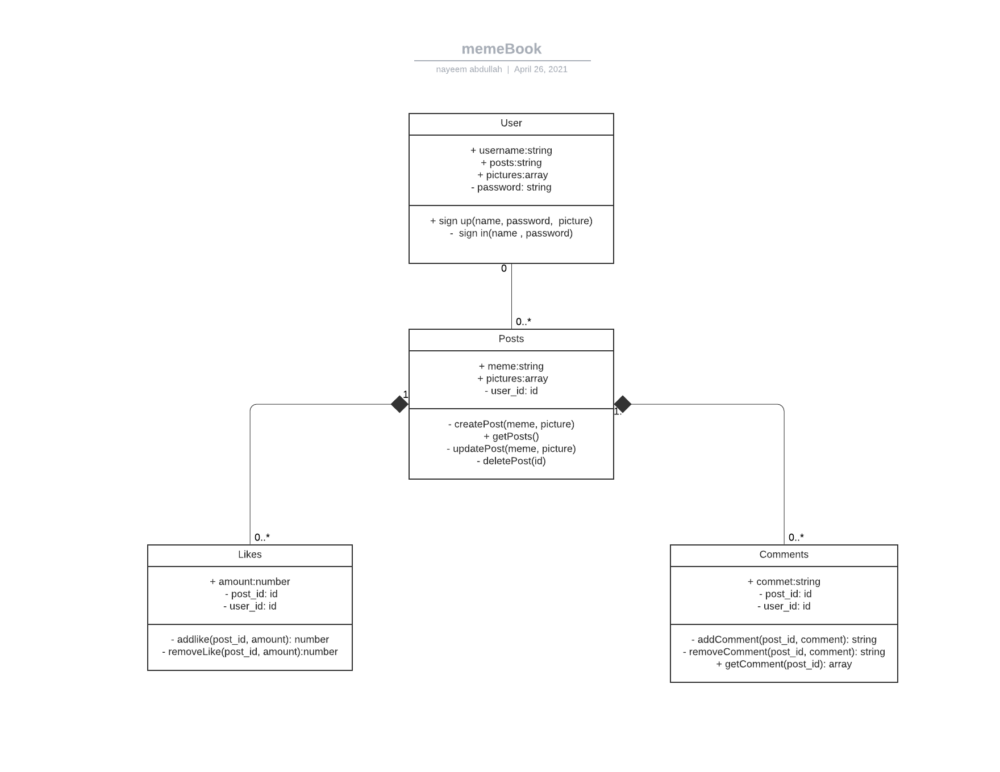

## MemeBook Server

**Tech stack**: TypeSrcipt, MongoDB, Express

**Backend Features**:

- [x] create delete update remove post API
- [ ] create delete update remove likes API
- [ ] create delete update remove comments API
- [ ] Login and Register API
- [ ] JWT Authentication
- [ ] Radis cache
- [ ] Dockerize whole process
- [ ] Add RabbitMQ

## ER Diagram for memeBook

## UML Class Diagram

- postman Documentation -
