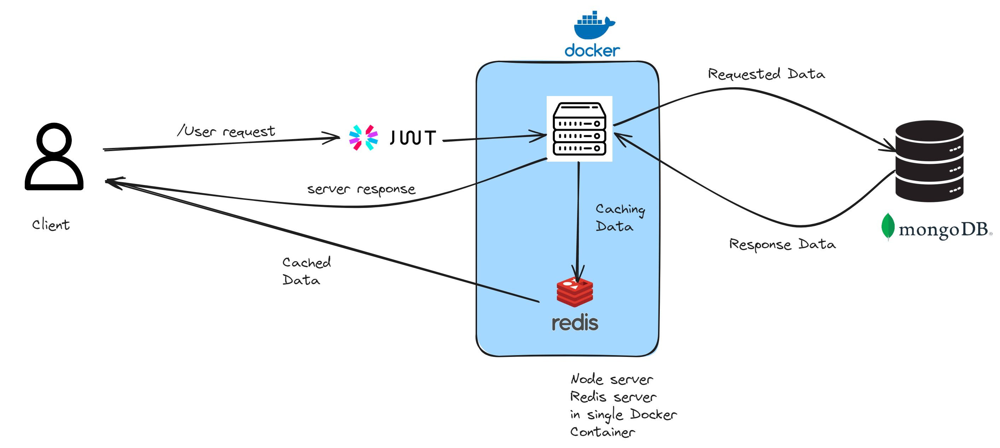
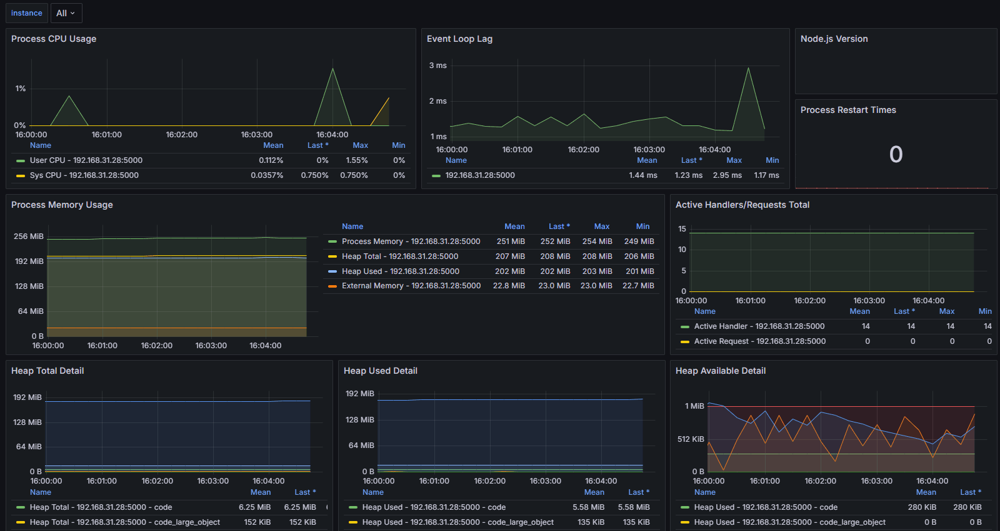

## MemeBook Server

**Tech stack**: TypeScript, MongoDB, Express, Node.js, Docker, Redis

**Backend Features**:

- [x] (create read update delete) posts API
- [x] (create read update delete) comments API
- [x] Login and Register API
- [x] JWT Authentication
- [x] Redis cache
- [x] Dockerize the whole Project
- [x] CI/CD Github Workflow with Docker Hub deployment
- [x] Server Monitoring with Grafana and Prometheus
- [ ] Cloud Infrastructure with terraform and Google Cloud

## Architecture

## Grafana Dashboard

## ER Diagram for memeBook

## UML Class Diagram

- Postman Documentation -
